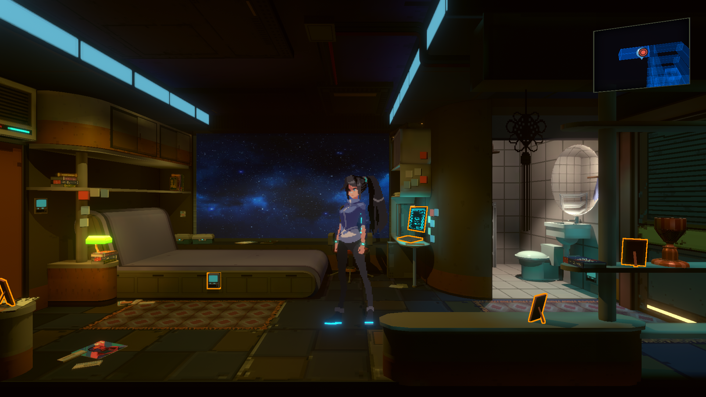

= ANNO: Mutationem Auto Scan

== About

A simple mod that highlights all interactable objects automatically.

== Installation
* Install BepInEx for Unity IL2CPP.
** The most recent version I was using was 64-bit `6.0.0-be.668` from https://builds.bepinex.dev/projects/bepinex_be[Bleeding Edge builds].
** If you need help with the installation, please https://docs.bepinex.dev/master/articles/user_guide/installation/unity_il2cpp.html[follow this guide].
* Download the https://github.com/thirtque/ANNOMutationemAutoScan/releases[latest release] of the mod and copy `ANNOMutationemAutoScan.dll` into `ANNOMutationem\BepInEx\plugins` folder.
* Run the game, and press `F8`.
** All interactable objects will be highlighted in orange.
** All non-empty containers will be highlighted green.

== Known bugs
* Some containers contain random items, and are highlighted orange instead of green.